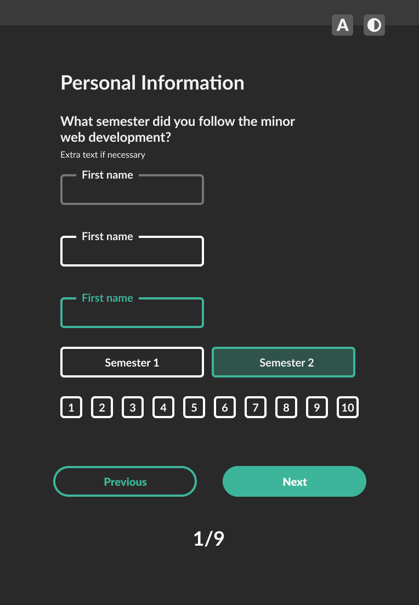

# Survey Minor Web Development

The internet is a global resource that should be accessible to everyone, regardless of their device or abilities. Unfortunately not all websites are always accesible. This subject, Browser Technologies, is all about creating inclusive and robust websites that work for all users.

This project is a survey for students who participated in the Minor in Web Development and is focused on web accesibility. The goal of this survey is to provide teachers with insight into how students experienced the minor and its different subjects and to make the survey accesible for everyone.

It is important to note that this survey does not have a backend and is not fully functional. It is merely a concept and a project developed as part of the Browser Technologies subject in the Minor in Web Development.

## Learning objectives

- You will learn what Progressive Enhancement is and how to apply it.
- You will learn to research, test, and implement Browser Technologies as enhancements.
- You will learn how to perform Feature Detection and what to do when a feature does not work or is not supported.

# Table of Contents

- [Survey Minor Web Development](#survey-minor-web-development)
  - [Learning objectives](#learning-objectives)
- [Table of Contents](#table-of-contents)
- [Core functionalities of the survey and features](#core-functionalities-of-the-survey-and-features)
  - [Survey requirements](#survey-requirements)
- [Design](#design)
  - [Sketching](#sketching)
    - [Design 1:](#design-1-)
    - [Design 2:](#design-2-)
    - [Design 3:](#design-3-)
    - [Design 4:](#design-4-)
    - [Design 5](#design-5)
- [Progressive enhancement](#progressive-enhancement)
- [Feature Detection](#feature-detection)
  - [Polyfills](#polyfills)
  - [My implementation of feature detection](#my-implementation-of-feature-detection)
    - [Feature detection Javascript](#feature-detection-javascript)
    - [Feature detection CSS](#feature-detection-css)
- [Accesibility](#accesibility)
  - [Color contrast](#color-contrast)
  - [Keyboard navigation](#keyboard-navigation)
  - [Screenreader](#screenreader)
- [Tested browsers](#tested-browsers)
  - [Desktop](#desktop)
  - [Mobile](#mobile)
    - [Firefox, Chrome, Safari Desktop, Samsung Internet, Safari Mobile](#firefox--chrome--safari-desktop--samsung-internet--safari-mobile)
    - [Flow v6.9.0](#flow-v690)
- [Reliable, Usable & Pleasurable](#reliable--usable---pleasurable)
  - [Reliable layer ✔](#reliable-layer--)
  - [Usable layer](#usable-layer)
  - [Pleasurable layer](#pleasurable-layer)
- [Back-end notes](#back-end-notes)
  - [Multiple submit buttons](#multiple-submit-buttons)
  - [Webserver](#webserver)
  - [Database](#database)
  - [Error Handling](#error-handling)
  - [Progressive Web App & Caching](#progressive-web-app---caching)
- [Reflection](#reflection)
- [Live Demo](#live-demo)
- [Installation](#installation)
- [License](#license)

<small><i><a href='http://ecotrust-canada.github.io/markdown-toc/'>Table of contents generated with markdown-toc</a></i></small>

<small><i><a href='http://ecotrust-canada.github.io/markdown-toc/'>Table of contents generated with markdown-toc</a></i></small>

# Core functionalities of the survey and features

- [x] Create a user-friendly survey where students can provide feedback on the minor web-development
- [x] To ensure the reliability of the feedback received, it is important to implement anonymity for those who desire it.
- [x] Provide a set of predefined options for students for obtaining specific responses (scale)
- [x] To gain insights into each individual student's experience, Provide open-ended questions that allow students to provide detailed information
- [x] Indicate which fields are required for completion. Use asterisks (\*) or other visual cues to highlight these fields and indicate that they must be filled in
- [x] Provide users with a progress indicator
- [x] Make sure the survey is functional without Javascript
- [x] Make sure the survey is accesible for everyone, including those who only use a keyboard or a screen reader or those who are color-blind

## Survey requirements

- [x] There needs to be an area where students can fill out their personal information, such as their name, student id and email
- [x] There needs to be a survey for every single course of the minor
- [x] Every single course needs to have the same set of questions, such as: rating about the subject, rating about the explanations of the subject and rating about your ability to understand the information that is provided (all on a scale from 1 to 10)
- [x] Make sure progressive disclosure is implement to reduce the overload of information for a student who is filling in the survey
- [x] Make sure that the user sees feedback validation when requirements of the form are not being met
- [x] Make sure that there's a clear flow for the user and allow users to navigate back to a previous question
- [x] Indicate the porgress of the user: where is the user in the flow
- [x] Make sure that there's a light- and darkmode
- [x] Radio buttons are supposed to be customized, don't make them look like radio buttons when CSS is enabled

# Design

## Sketching

Before I started with this survey I made sketches to get a general idea of how I wanted my form to look like:


I also made different sketches on how to display the scale from 1 to 10.


I also made different designs, some of which the contrast wasn't acceptable or the buttons didn't always look like buttons if I'd as a different student for testing.

These are my designs:

### Design 1:


### Design 2:


### Design 3:


### Design 4:




### Design 5

I actually started with design 4, but I ended up disliking the design, so since I was quite in a hurry, I decided to use the following tool: https://realtimecolors.com/

I used the following 2 color-schemes and adjusted these a bit:

- lightmode: https://realtimecolors.com/?colors=040301-ffffff-f8ad62-ffd2a8-f8ad62
- darkmode: https://realtimecolors.com/?colors=ffffff-0f1b24-f8ad62-ffd2a8-f8ad62

I also made sure to often check the contrast with this tool: https://www.siegemedia.com/contrast-ratio#%23ffffff-on-%23c25700

I basially started out with the color palette and just styled as I was making the form and this is how it ended up looking like:


Originally I wanted to center this container, but that required and extra class, so I didn't do that.


# Progressive enhancement

Progressive enhancement is an approach in web development that focuses on delivering a baseline experience to all users, while adding additional features.
I used LocalStorage as progressive enhancement, because It allows for local data storage within the user's browser, which can be highly beneficial in certain scenarios.

For instance, when working with a form that doesn't have a backend or encounters a failure in submitting data to the backend, LocalStorage enables the temporary storage of that data locally. This ensures that the user's input is not entirely lost and can be retrieved later. This also means that the user can see the previous data when going back on a previous page if they want to change this data. This new data is then overwritten with the new data.

LocalStorage is also advantageous in situations where there is an internet outage. By saving data locally, when the user revisits the page and regains internet connectivity, their data remains intact. This feature contributes to a less frustrating and more enjoyable user experience.

It is important to note that the survey can still function without relying on LocalStorage. The core functionality of the survey should be available to all users, regardless of whether LocalStorage is supported by their browser or not. The use of LocalStorage should be considered as an additional feature that enhances the overall experience for users with more advanced capabilities.

# Feature Detection

Feature detection is a technique used in web development to determine whether a specific feature or functionality is supported by the user's browser or environment. Rather than relying on assumptions based on browser, feature detection focuses on detecting the actual capabilities of the browser or environment being used. This allows developers to adapt their code and provide alternative approaches or fallbacks for browsers that lack support for certain features.

```

javascript:

if (typeof document.createElement('canvas').getContext === 'function') {
  // HTML5 Canvas is supported
  // Add your code for using the Canvas feature here
} else {
  // HTML5 Canvas is not supported
  // Provide fallback or alternative functionality here
}

css:

@supports (display:grid) {
    div {
        display:grid
    }
}

```

## Polyfills

You can also use polyfills. Polyfills are code snippets or scripts that provide modern functionality or APIs to older browsers that lack native support for those features. They help bridge the gap between older browsers and the latest web standards, allowing developers to use new features even in browsers that don't natively support them.

The issue with polyfills are that the code needs to be regularly updated, otherwise there can be security risks or other issues. Polyfills also increase the size of your application, which is something what you usually want to avoid, especially for users with slower internet connections or limited bandwidth.

Two examples of feature detection are:

## My implementation of feature detection

I mostly used this: https://caniuse.com/?search=flexbox, to check browser support for specific features, such as flexbox or LocalStorage. I also made certain choices to take things out of my work, such as the `:has` selector, which I used before. I took this out, because Firefox doesn't supports it. I fixed the dark- and lightmode by just using `prefers-color-scheme` instead.


### Feature detection Javascript

I explained earlier why I used LocalStorage. I also implemented a feature detection to check if the browser supports this and, like I said before, the survey is still able to function without it. If the browser does have LocalStorage, then it will run the code inside the 'if'.

```

// src: http://diveintohtml5.info/storage.html
// feature detection
function canUseLocalStorage() {
	try {
		if ('localStorage' in window && window['localStorage'] !== null) {
			localStorage.setItem('test-roshnie', true);
			localStorage.getItem('test-roshnie');
			localStorage.removeItem('test-roshnie');
			return true;
		}
	} catch (e) {
		return false;
	}
}

// feature detection
if (canUseLocalStorage) {
	const textAreas = document.querySelectorAll(`textarea`);
	const inputs = document.querySelectorAll(`input`);
	const elementsToSave = [...textAreas, ...inputs];

	for (const element of elementsToSave) {
		// https://stackoverflow.com/a/46323878
		// looking in localstorage if previousvalue is there
		const previousValue = localStorage.getItem(element.name);

		// Restore values from local storage
		if (previousValue) {
			// if its a radio:
			if (element.type === 'radio') {
				// just get the first form in the html
				const form = document.forms[0];
				// form contains radiogroup thats connected by name
				const radioButtonGroup = form[element.name];
				// looping through the radio buttons
				for (const button of radioButtonGroup) {
					// look for the previousvalue and set it to checked
					if (button.value === previousValue) {
						button.checked = true;
					}
				}
			} else {
				// just changes the value of previousvalue
				element.value = previousValue;
			}
		}

		// Save values to local storage on change
		element.addEventListener('change', (e) => {
			// if change on element of radio
			if (e.target.type === 'radio') {
				const form = document.forms[0];
				const radioButtonGroup = form[e.target.name];
				// set value of element or radiobutton value
				localStorage.setItem(e.target.name, radioButtonGroup.value);
			} else {
				localStorage.setItem(e.target.name, e.target.value);
			}
		});
	}
}

```

### Feature detection CSS

I actually didn't have to use this, so I took it out, because all the browsers, I tested on supported flexbox. The only browser that patially support it, was Flow. This is because the `gap` didn't work, even with grid. However other things of flexbox did work.

```

@supports (display:flexbox) {
    div {
        display:flexbox
    }
}

```

# Accesibility

## Color contrast

Color contrast plays a crucial role in making content accessible to all users, including those with visual impairments or color blindness.

High color contrast also enhances readability of an application. Without proper contrast, text can blend into the background, causing eye strain and making it difficult to read or comprehend the content.

To make sure that my application had high enough color contrast, I used a contrast checker, made by Lea Verou: https://www.siegemedia.com/contrast-ratio#%23ffffff-on-%23c25700

I repeatedly checked my colors just like on this screenshot:


## Keyboard navigation

I tested my survey using only my keyboard and navigated through the application with my tab and arrow keys, to make sure that my survey is accesible. Since I implemented `:focus` states, the user is able to see feedback within the survey on where the pointer of the keyboard is currently at. I also tested to see if the order is logical.

I also noticed that on certain browser, like Safari and Firefox you manually had to turn on the feature to be able to tab through your application. Apparently the shortcut is `option + Tab` on Macbook.

## Screenreader

I used the screenreader from Windows 10. I noticed that sometimes I had to press on shit for it to read certain text. I also noticed that the table was a bit annoying to go through, because it reads which row and then after pressing a few times on the arrow it will give you the number. I'm not a screen-reader user, but overall it wasn't impossible to go through my application.

# Tested browsers

## Desktop

- Google Chrome v113.0.5672.126
- Google Chrome v115.0.5790.0
- Mozilla Firefox v113.0.1
- Safari Desktop v16.4
- Flow v6.9.0

## Mobile

- Google Chrome v113.0.5672.121
- Samsung Internet v20.0.6.5
- Safari Mobile v16.6

### Firefox, Chrome, Safari Desktop, Samsung Internet, Safari Mobile

All of these browsers actually responded the way I thought they would and my design looked all the same on these. There were no differences. Like I said before, since I knew certain things, due to checking on `canIUse`, I actually think I made my life a bit easier. For example, at first I used the `:has` selector for the darkmode, but I saw that it was not supported by Firefox, so I simply took it out and used `prefers-color-scheme` instead.

### Flow v6.9.0

Flow is a new browser that features a completely new multi-threaded rendering engine, distinct from WebKit, Gecko, or Blink. Developed by Ekioh, Flow aims to provide improved performance and rendering capabilities for user interfaces.

When a user enters a URL (Uniform Resource Locator) or clicks on a link, the browser initiates a series of steps known as the "browser flow" to retrieve and display the requested web page.

Since Flow isn't featured in `canIUse` it became a bit difficult. I noticed the following things:

- I used `@media` for `prefer color schemes` and had my colors in the `:root` of the media query, but Flow does NOT support `@media`, so I just put all of my colors directly in my CSS in the `:root`, this means that my darkmode didn't work.
- There's no `gap` support (`grid` and `flexbox`)
- The `width` had an issue on anchor tags and buttons
- It was impossible to tab through the page
- Custom style on `:checked` doesn't work at all
- `::placeholder` doesn't work
- `apparearance` doesn't work, because my radio buttons still show (I did not hide them, because otherwise the user won't be able to see what they selected)
- `placeholder=""` doesn't show the placeholder
- Can't select any text
- Javascript doesn't entirely work

# Reliable, Usable & Pleasurable

It is a good practice to build your app as following:

- Reliable aka functional (HTML), usable (CSS), pleasurable (JS).

I already mentioned the core functionalities of the form, but I just want to adress again the most important functionalities:

The most important functionalities of the form are that the user is able to input their information and to submit this information. It's also important that the user receives feedback when filling in this information and also when they filled in something that was "wrong" or "invalid". The user needs to know what they did wrong, to fix that.

## Reliable layer ✔

These are the following thins I did in my "reliable" layer (also known as "functional" or HTML).

- In the functional layer I used the `form` tag to create a form. I used different `types` of `inputs`, so the user can fill in their information.

- I also used a button with type of `submit`, so that the browser knows to submit the information. This submitting should happen in the back-end, which I will explain in my `back-end notes`.

- To be able to validate my form in this layer, I used different types of `input types`, so that a number can be filled in as a number or a checkbox as a checkbox. I also used `required` in case the user forgets to fill something in. They will get to see when this happens.

- I also grouped questions with inputs together by using `fieldset` and for questions I used `legend`.

- I used different HTML files or pages, to show a user, so I can use this as "progressive disclosure" and the user won't be overwhelmed by seeing too many questions. In order to get to the next page, I made it so that when the user `submits` the form, they will get send to the path of a specific html file that I used in the `form action=""` attribute.

- I also made it so that, depending on which theme you're using on your computer (light or dark mode), you will get to see that theme when going to this survey.

## Usable layer

These are the following thins I did in my "usable" layer (also known as CSS). In this layer, I basically "levelled up" my functional or reliable layer, to something more usable. This is when "progressive enhancement" comes into play.

Progressive enhancement is a design approach where a website should work on all browsers and devices with all its basic functionalities

- I added custom colors to create my dark and light mode

- My styling has high contrast

- I added custom fonts as well as a fall-back font to my survey,

- I made the radio buttons "invisible" and added styling for it instead, so it looks like a button (except in flow, in which case you can see the radio buttons through it but otherwise it's impossible to know for the user which radio button they have filled in)

- I added hover states as well as focus and active states

- I also added form validation with `:valid` and `:invalid`

- My survey is completely responsive. You can use it on bigger screens but also smaller screens.

## Pleasurable layer

In this layer, the user will have the best user experience. In this layer Javascript is applied.

- I added localStorage so that when you want to change the page or refresh the page or there's an internet outage, your data will still be saved locally

# Back-end notes

This section will cover all the information that the developer working on the back-end of this survey needs to know.

## Multiple submit buttons

During this survey I have multiple anchor links, that also serve as submit button and to go to the next or previous part of the survey. Once the user clicks on the `a` tag with the next in it, on the first part of the form, a new document within the database is created with the information that the user filled in. This is done with a `POST` request via the `a` tag.

Aditionally an user ID has been created within this document. This user ID is automatically generated and unique for every user. We need this user ID so we can reference back to the same document whenever the user submits other parts of the form with the `a` tag.

Once the user goes back to a previous part in the form, the data is taken from the database to display what the user had previously filled in. All we want to do is that the user is able to update or change this information. When clicking on the next button, a `PUT` request is made to update the data of the user. This `PUT` request is only made when data of the user already exists in a certain input field. Otherwise is will be a `POST` request, like I explained earlier.

## Webserver

A webserver will handle incoming requests from clients and routes them to the appropriate backend components. It serves the HTML, CSS, and JavaScript files required by the client-side application.

## Database

A database will be used for all the incoming data from the survey

## Error Handling

Handle and communicate errors to the client-side application. This includes returning appropriate HTTP status codes, error messages, and logging errors for troubleshooting.

## Progressive Web App & Caching

In case of an internet outage it is also possible to make the survey a PWA, in which case you can cache the data from the form, which might make the form faster, especially if the internet is slow. Loading the page would take a bit longer. The page also wouldn't fail if there's an internet outage, because it will be cached.

# Reflection

Things I would do differently if I had more time:

- I would have liked to add more animations or transitions, make it look extra fancy.
- I would've liked to make a progress bar with javascript that looks pretty fancy.
- Instead of explaining about the back-end, I would've liked to make one myself with mongoDB or something to save the user's data in it.
- I would've liked to improve my design because I'm not completely happy with it, but I also spent a lot of time trying to figure out what I wanted. I just wasn't sure if I could pass this subject with a different design and spent more time than I wanted trying to figure out if the contrast was okay.

# Live Demo

Link of my live demo: https://rvdegroen.github.io/browser-technologies-2223/

# Installation

1. Clone this repository with: `git clone [COPY LINK FROM REPO]`

2. Open either the `index.html` in your browser or use the live server extension with `http://localhost:5500/`

# License

This project is licensed under the MIT License. See the LICENSE file for more details.
